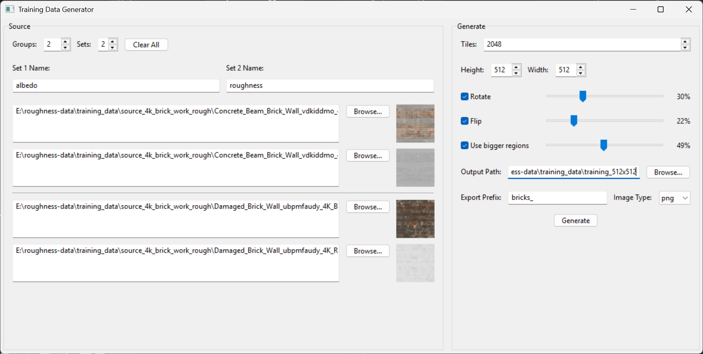
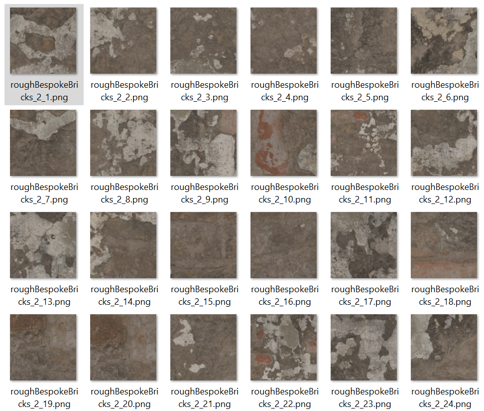
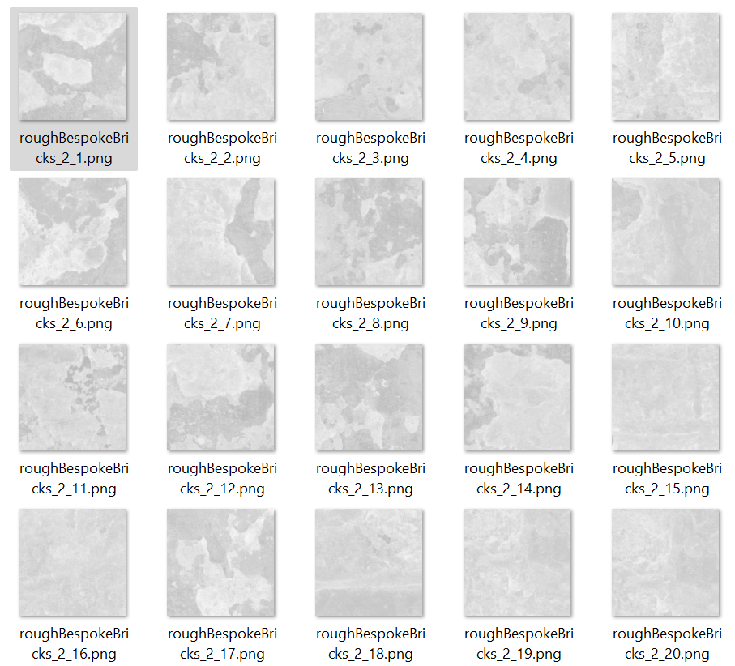

# Training Data Pair Creator

This is a tool to help produce training data 'pairs' (or more) for neural networks. It takes groups of source images and generates a set of tiles from each source image. It can also apply random transformations to the images, such as rotation and flipping, to increase the diversity of the training data.



Produces lots of little images likes in folders specified...

albedo/

roughness/


It possible to process more then two images at a time, generate larger sets of data.


> This is a program written using Github Copilot, its clunky and could be made a whole lot faster. Was just a quick hack to get something working.

## Installation

### Prerequisites

- Python 3.8 or higher
- pip (Python package installer)

### Setup Instructions

1. **Clone the repository:**

   ```bash
   git clone <repository-url>
   cd game-dev-ai-image-pair-training-data-generator
   ```

2. **Create a virtual environment:**

   ```bash
   python -m venv .venv
   ```

3. **Activate the virtual environment:**

   - On Windows (PowerShell):

     ```powershell
     .venv\Scripts\Activate.ps1
     ```

   - On Windows (Command Prompt):

     ```cmd
     .venv\Scripts\activate.bat
     ```

   - On macOS/Linux:

     ```bash
     source .venv/bin/activate
     ```

4. **Install dependencies:**

   ```bash
   pip install -r requirements.txt
   ```

5. **Run the application:**

   ```bash
   python main.py
   ```

### Deactivating the Virtual Environment

When you're done using the application, you can deactivate the virtual environment:

```bash
deactivate
```

## Features

* **Dynamic Source Image Handling:** Add multiple groups and sets of source images.
* **Flexible Tiling:** Specify the number of tiles to generate, and their dimensions.
* **Image Augmentation:** Apply random rotations, flips, and use larger source regions to create more varied training data.
* **Persistent Settings:** All your settings are saved in a `settings.ini` file, so you don't have to reconfigure everything each time you open the app.
* **Image Preview:** Hover over a source image path to see a preview of the image and its dimensions.
* **Progress Indicator:** A progress bar shows the status of the image generation process.

## How to Use

1. **Set up your source images:**
    * Use the "Groups" and "Sets" controls to define the structure of your source data.
    * For each set, provide a name. This will be used as the folder name for the output images.
    * For each group and set, click "Browse..." to select your source images.
2. **Configure the generation settings:**
    * **Tiles:** The number of new images to generate from the source files.
    * **Height/Width:** The dimensions of the output tiles.
    * **Rotate/Flip:** Check these boxes to enable random rotations and flips. Use the sliders to control the probability of these transformations.
    * **Use bigger regions:** Check this to randomly select a larger area from the source image and scale it down to the tile size. This can help create more varied data.
    * **Output Path:** The directory where the generated images will be saved.
    * **Export Prefix:** A prefix for the output filenames.
    * **Image Type:** The format for the saved images (PNG, JPG, BMP).
3. **Generate:**
    * Click the "Generate" button to start the process.

## Settings Explained

### Source Panel

* **Groups:** A group represents a collection of source images that will be processed together. For example, a color map and a normal map.
* **Sets:** A set represents a variation of a group. For example, you might have a "clean" set and a "dirty" set of textures.
* **Set Name:** The name of the folder where the output images for that set will be saved.

### Generate Panel

* **Tiles:** The total number of image tiles to generate.
* **Height/Width:** The dimensions (in pixels) of each generated tile.
* **Rotate:** When enabled, each generated tile has a chance to be rotated by 90, 180, or 270 degrees (only 180 for non-square tiles).
* **Flip:** When enabled, each generated tile has a chance to be flipped horizontally or vertically.
* **Use bigger regions:** When enabled, the tool may cut a larger section from the source image and scale it down to the tile size, creating a 'zoomed out' effect.
* **Output Path:** The main folder where your generated images will be stored. The images will be organized into subfolders based on their set names.
* **Export Prefix:** A string that will be added to the beginning of each generated filename.
* **Image Type:** The file format for the saved images.
